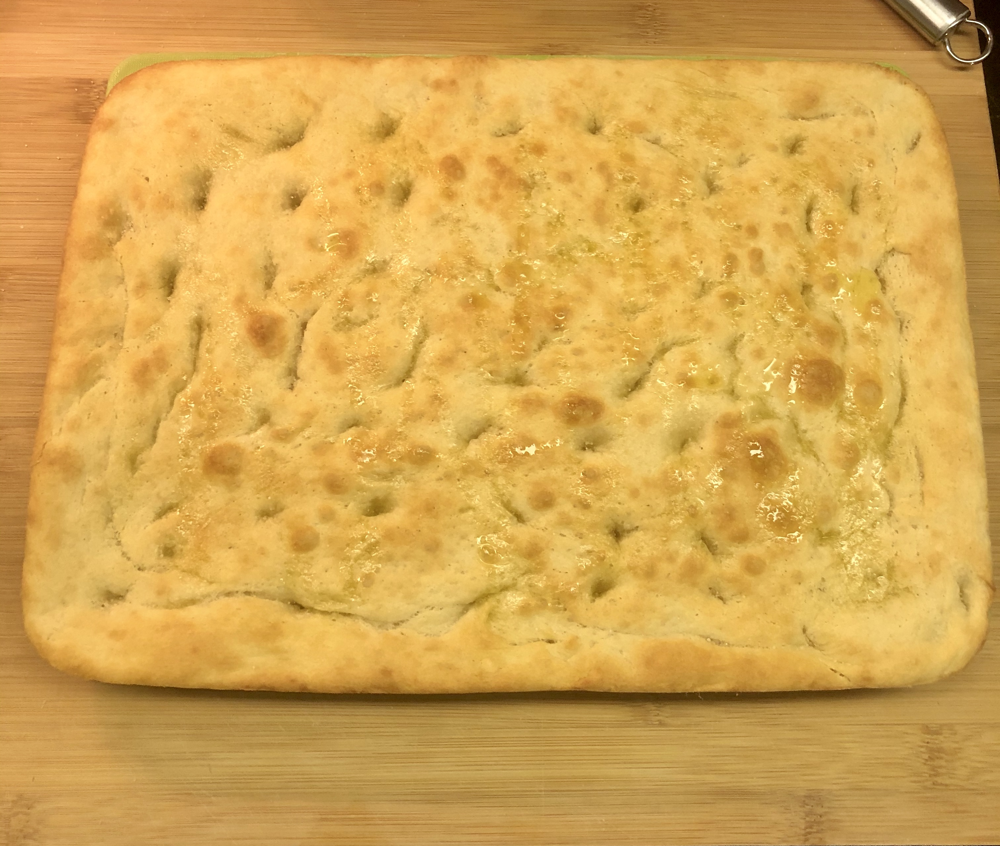

# Focaccia Genovese
Contributed by [pstirparo](https://github.com/pstirparo)

You can find different type of focaccia recipes, different variants, but the original focaccia comes from Genova :)

Be aware, it take 3h time from starting till is ready to eat. So considering that respecting the leavening time is crucial, if you don't have 3h then better not start.

## Ingredients
These ingredients are for a baking tin of about 25x40cm 
- 190g Water 
- 310g Flour (ideally type 0 W260-280)
- 20g Olive Oil (EVO)
- 7g Salt
- 3g Malt (or one spoon of Honey/Sugar) 
- 17g Fresh yeast 

## Process
I find it useful to split the process in "milestones", since there are four main resting/leavening blocks. Here you go:

**Dough**

1. Dissolve water, salt, malt and oil.
2. Add half of the flour until a thick but still liquid paste is obtained.
3. Add the well-crumbled yeast. If you use dry yeast, dissolve it in a little warm water (30C) kept aside by the amount of initial water. The water should not be too hot or the yeast will be damaged.
4. Work the dough by adding the remaining flour until a compact but not hard dough is obtained.
5. Cover well and leave the dough to rest for 15 minutes on a wooden board (or pan), covered with a cloth so that it does not take in too much air (this avoids the formation of the crust).

**First rest 15m**

6. After those 15m, fold the dough into 2 or 4 depending on the strength of the flour. This process gives strength to the dough. If you use strong flour (12% gluten) you can avoid this step or fold it only once.
7. Pour a little olive oil into the baking tin and put the dough on it that it gets oily, then turn it to the other side. Being all oiled, that hard crust patina will not form
8. Leave to rise for 40-60m in the oven off with the door closed. In winter it is better to turn on the oven light to keep the room warmer (about 30 degrees)

**First leavening phase 40-60m**

9. After the first leavening, spread it in the pan with your hands trying not to pull it, but to crush it as much as possible until it occupies the whole baking tin.
10. Sprinkle the surfaces with a rather abundant veil of salt. This is used to season the focaccia, but also to prevent the crust from forming during the leavening.
11. Put it back in the oven to rise for another 30m

**Second leavening phase 30m**

12. Pour some warm water (30° C) on the surface. The water will keep the dough moist and give that characteristic white color of the focaccia Genovese to the bottom of the holes.
13. Pour a little EVO on the surface and spread water and oil on the whole surface with your hand. The dough is super soft, so be delicate.
14. Energetically imprint the entire surface with your fingers to form the characteristic holes.
15. [optional] add onion / olives / cherry tomatoes in case of seasoned focaccia. I like it the original version: plain.
16. Put in the oven off for another 60m (or 75m if colder environment)

**Third leavening phase 60m**

## Baking
Bake the focaccia in the preheated oven and cook at 220-240 degrees for 15-20 minutes. I usually stay closer to 15m, but it will depend on your hoen of course. Each oven is different and times can vary considerably.
Once baked, take it out of the oven and turn the focaccia on a grill to rest so that the air also passes under it to prevent it from becoming spring.

Give another round/brushstroke of EVO on the surface (and a little bit of salt too ;)) and serve it hot!!!

Enjoy it ;)

