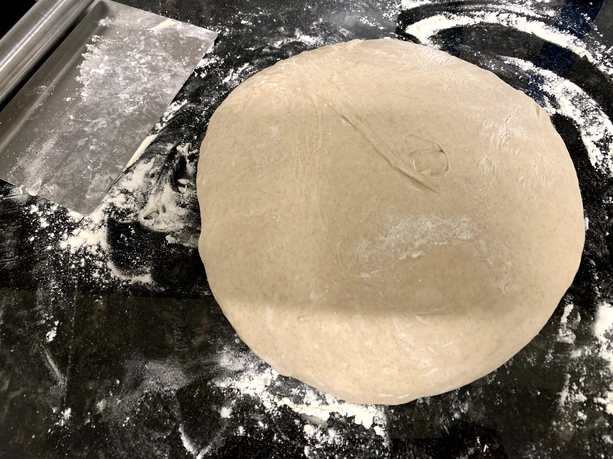
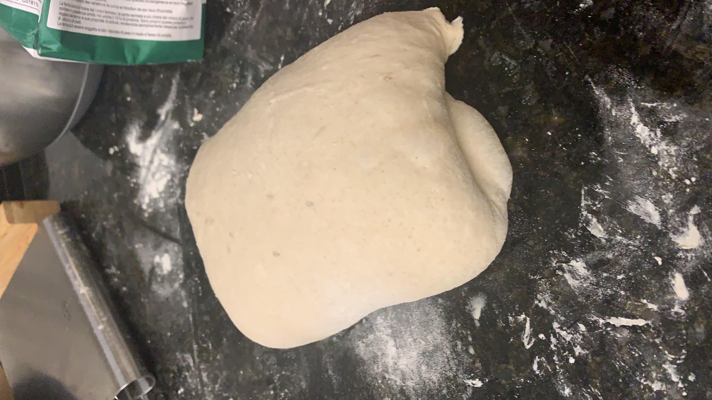
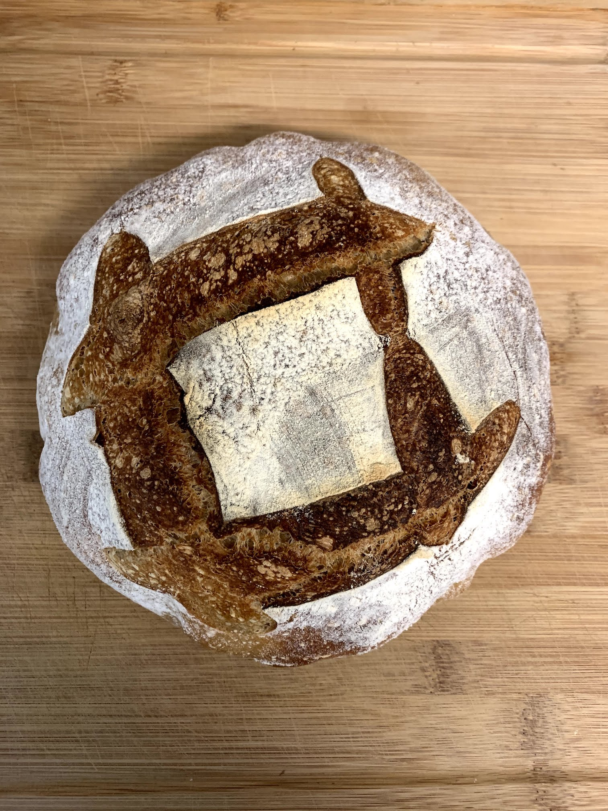

# tomchop's basic sourdough

This is the recipe I started my sourdough journey with. I made a bunch of mistakes at first (and probably still am), so trust me when I say this recipe is quite forgiving.

## Prerequisites

1. Basic tooling (check out the [tooling](tooling.md) page)
2. A healthy sourdhough starter (there's no guide yet, but you can make one from scratch following The Perfect Loaf's [guide](https://www.theperfectloaf.com/7-easy-steps-making-incredible-sourdough-starter-scratch/))
3. Some flour, or a mix of flour. Go wild!
4. Water

## Ingredients

Using baker's percentages, this is the recipe that I have going for one loaf:

| Ingredient | Grams | Bakers' % |
| ---------- | ----- | --------- |
| Flour      | 500g  | 100%      |
| Water      | 400g  | 80%       |
| Levain     | 100g  | 20%       |
| Salt       | 10g   | 2 %       |

My levain is 100% hydration (means I always feed it with equal amounts of flour and water).

NOTE: Levain and starter are basically the same product. _Starter_ is the gooey water-and-flour mix that keep feeding, and _levain_ is the bit of recently-fed starter that you indent to use in your dough mix.

## Timeline & recipe

One of the hardest things for me to figure out at first was how to time my day if I wanted to bake a loaf. How long is the bulk rise gonna take? What about the autolyse? The retardment?

This is how my timeline usually goes.

### Initial mix (~4 hours)

#### 10:00 - Wake up, feed starter

This takes 5 minutes. I usually snap an elastic band around the container where the starter is so I can easily keep track of how active it becomes over time.

NOTE: How fast it takes for the starter to become active is closely linked to the ambient temperature. In the winter, I usually leave it near my heater (~26 ºC). People have also reported that leaving it in the oven with just the light on is good enough. (I didn't know the light produced heat, but hey.)

#### 13:00 - Check on starter

Go check how your starter's doing. I usually wait until it's _tripled_ volume before deciding to move forward. You can double-check if your starter is ready for usage by throwing a scoop of it in water. If it's ready, it should quickly float back to the surface. Otherwise, let it ferment for a bit longer, and check every half hour or so.

#### 13:05 - Mix dough

Time to mix the dough! Put 380g of water* in a big bowl, and throw in your 100g starter. Mix until diluted, then add the 500g flour to the mix. Mix well, pinching and squeezing with your fingers until everything is well incorporated. Yes, it will make a mess, but you can use a dough spatula to remove excess dough from your fingers into the mix.

Once this is done and you have a somewhat homogeneous mass of dough, cover (I use a tea towel) and let it rest for 40 to 60 minutes, in the same spot you let your starter ferment. This process is called _autolyse_.

#### 14:00 - Final mix

Once the mix is autolysed, throw in the 10 grams of salt and the remaining water (20g), mix and pinch until everything is incorporated. The mixture will look and feel weird at first, but the more you mix it the more it will come back together (should take a minute or two).

### 14:00 - 19:00 Bulk rise + stretch & fold

Now, set a timer to 4 or 5 hours from now. You'll be letting the dough rise during most of that time, except during the first two hours, where you're gonna perform 4 sets [1] of "streches and folds", which helps develop the gluten in the dough. These sets are performed ~30 mintues apart, during the first two hours of the bulk rise.

One set consists of shoving your hand under the dough, grabbing a good chunk of it, and stretching it up as much as possible (without it tearing), then folding it back down on the opposite side. Do this four times, once on each corner of the bowl. Four times folding & stretcihng makes *one set*. Let rest 30 minutes, then repeat.

[1] I sometimes do more than 4 sets; I do it until the dough starts to smooth out (that's the indicator that the gluten has developed enough strength to hold its shape when you'll drop it on the counter). Depending on the temperature in my kitchen, I can do it up to 6 times.

### 19:05 - Bench rest

Remove the dough from the bowl on your counter. Your goal is now to pre-shape the dough into a ball with a good "surface tension". You can achieve this by "turning" the mass of dough on itself and tucking it underneath it until it develops surface tension (check out [this video](https://www.youtube.com/watch?v=VuIT0RJDdZ8) on how to do it). The dough might still be sticky, but try not to use too much flour during this process (I usually end up having to flour my hands a bunch to stop the dough from sticking).

Once you have your ball, let it rest on the bench for 30 minutes, covering with a kitchen towel.

### 19:30 - Final shaping and proofing

Now's the time to shape your bread and put it in a proofing vessel and into the fridge overnight.

Dust a kitchen towel with rice flour (non-glutinous flour will be better as it will not be absorbed into the mixture overnight) and line your vessel with it (can be a regular bowl or a proofing basket).

If you checked out the video above, you'll see that the dough kinda still sticks to the baker's hadns then they drop it in the banneton. This extra shaping is to avoid that, and try to have a totally "sealed off" ball of dough, where all of the surface is smooth.

Shape your bread by pulling its extremities and folding them back in the middle. You should end up with a tight package. A [great guide](https://www.theperfectloaf.com/guides/shaping-a-boule/) is available on The Perfect Loaf's website. (make sure to check out the video at the end of that article for a full demo.)

Leavet it in the fridge overnight! I usuall count 12 hours of cold proofing (or _retarding_; the cold slows down the proofing process), but the more you leave it the more sour your loaf will be, so if that's your thing, feel free to leave it in a bit more.

End result should look kinda like this:

### 09:00 - 10:00 (next day) - the bake

You're going to want to bake your bread in a humid environment. To achieve this, you can use a dutch oven ([casserole with fitting lid](https://www.lecreuset.fr/cocotte-ronde-en-fonte-emaillee)), or shove a tray with ice cubes at the bottom of your oven. I've never tried the latter. You can also use a [cast-iron combo cooker](https://lodgecookware.com.au/cast-iron-3-2-quart-combo-cooker/).

Put your dutch oven in your oven (including lid) and pre-heat the oven to 260 ºC. I wait until the oven tells me it's warm enough, but some people pre-heat for an hour. I have not found any difference. While it's pre-heating, take the banetton out of the fridge, and get some baking parchment ready.

Once the oven tells you it's ready, flip the banetton on the parchment paper (I place the parchment paper on top of the banetton, a wooden cutting board on top of the paper, and flip the whole thing slowly)

You'll want to score the dough to make sure it burtsts in the right places. You can use a razon blade or a sharp knife. A box pattern works well, so does a longitudinal cut a few centimeters deep. Your choice, feel free to experiment!

From this point on, things are **extremely hot**, so please be careful. Using heavy-duty oven mitts, take out the Dutch oven, open it. I grab the tips of the parchment paper and use it to slide the dough down the casserole without burning my hands. Cover it up with the lid, and put back in the oven.

As you do this, decrease the temperature to 230 ºC, and let it bake for 20 minutes. After 20 minutes, remove the lid from the Dutch oven, and bake fore another 20 minutes, or until the crust (that you can now see) reaches the color you desire. I've found that the smaller the loaves, the shorter it takes. 20m/20m is good for a 500g-flour loaf, but for a 300g-flour loaf (which I've been doing) I do 20m/13m (I like a soft, thin crust).

### Cool 10:00 - 11:00

Using oven mitts, remove the Dutch oven from the oven and take the baked loaf out. Use exterme caution as everything is still very very hot. Let cool the loaf for about an hour (this is to prevent moisture from escaping the loaf should you cut it open too early). Iknow it's hard, but it's worth the wait!

Enjoy your bread!

